# 🔍 Lavandowski - AML Analysis Platform


**Lavandowski** é uma plataforma avançada de análise AML (Anti-Money Laundering) que utiliza inteligência artificial para detectar e analisar possíveis casos de lavagem de dinheiro e atividades suspeitas em transações financeiras.

## 📋 Índice

- [🔍 Visão Geral](#-visão-geral)
- [🏗️ Arquitetura](#️-arquitetura)
- [🛠️ Tecnologias](#️-tecnologias)
- [⚙️ Instalação](#️-instalação)
- [🔧 Configuração](#-configuração)
- [🎯 Funcionalidades](#-funcionalidades)
- [🤖 Agentes de Análise](#-agentes-de-análise)
- [⏰ Tarefas Automatizadas](#-tarefas-automatizadas)
- [🌐 API Endpoints](#-api-endpoints)
- [📊 Monitoramento](#-monitoramento)
- [🚀 Uso](#-uso)
- [👥 Desenvolvimento](#-desenvolvimento)

## 🔍 Visão Geral

O Lavandowski é uma solução completa para análise de compliance financeiro que combina:

- **Análise Automatizada por IA**: Utiliza modelos GPT-4 e o3-mini para análise inteligente de padrões suspeitos
- **Detecção de Riscos**: Sistema de pontuação de 1-10 para classificação automática de riscos
- **Múltiplas Fontes de Dados**: Integração com BigQuery, Big Data Corp e APIs externas
- **Processamento em Tempo Real**: Interface web responsiva com análises instantâneas
- **Tarefas Automatizadas**: Background jobs para análises programadas e gestão de usuários
- **Compliance Integrado**: Seguindo normas BACEN e melhores práticas AML/CFT

### 🎯 Principais Recursos

- ✅ **Detecção avançada de padrões suspeitos** em transações
- ✅ **Classificação automática de risco** com IA
- ✅ **Análise de vínculos** e conexões entre entidades
- ✅ **Geração de relatórios** detalhados e exportáveis
- ✅ **Integração com sistemas** de compliance
- ✅ **Dashboard interativo** com métricas em tempo real
- ✅ **Processamento assíncrono** para alta performance
- ✅ **Cache inteligente** com Redis para otimização

## 🏗️ Arquitetura

O sistema é composto por múltiplas camadas e componentes especializados:

### 📦 Componentes Principais

```
┌─────────────────┐    ┌─────────────────┐    ┌─────────────────┐
│   Frontend      │    │   API Layer     │    │   Background    │
│                 │    │                 │    │                 │
│ • Streamlit     │◄──►│ • Flask API     │◄──►│ • Celery        │
│ • Dashboard     │    │ • REST Routes   │    │ • Redis Queue   │
│ • Analytics     │    │ • Auth Middleware│    │ • Scheduled Jobs│
└─────────────────┘    └─────────────────┘    └─────────────────┘
         │                       │                       │
         └───────────────────────┼───────────────────────┘
                                 │
         ┌───────────────────────▼───────────────────────┐
         │              Core Engine                      │
         │                                              │
         │ • Alert Analyser    • Sanctions Analyser    │
         │ • GPT Integration   • Risk Scoring          │
         │ • Report Generator  • Decision Engine       │
         └───────────────────────┬───────────────────────┘
                                 │
         ┌───────────────────────▼───────────────────────┐
         │              Data Layer                       │
         │                                              │
         │ • BigQuery         • Big Data Corp           │
         │ • Redis Cache      • External APIs           │
         │ • Optimized Queries • Performance Monitoring │
         └───────────────────────────────────────────────┘
```

### 🔄 Fluxo de Dados

1. **Ingestão**: Dados coletados de múltiplas fontes (BigQuery, APIs externas)
2. **Processamento**: Análise por agentes especializados usando IA
3. **Classificação**: Sistema de scoring e decisão automatizada
4. **Saída**: Relatórios, dashboards e integração com APIs de compliance

### 📊 Diagrama de Arquitetura Completa

```mermaid
flowchart TD
    %% Data Sources
    subgraph DataSources["📊 Fontes de Dados"]
        BQ[(BigQuery<br/>📋 Datasets AML)]
        BDC[Big Data Corp<br/>🔍 Sanctions & KYC]
        API_RISK[Risk API<br/>⚠️ Monitoring]
        REDIS[(Redis<br/>💾 Cache)]
    end
    
    %% Entry Points
    subgraph EntryPoints["🚪 Pontos de Entrada"]
        WEB[Streamlit Dashboard<br/>🖥️ Interface Web]
        FLASK[Flask API<br/>🌐 REST Endpoints]
        CELERY[Celery Workers<br/>⚙️ Background Tasks]
    end
    
    %% Core Processing
    subgraph CoreEngine["🧠 Motor de Análise"]
        ALERT_AGENT[Alert Analyser<br/>🚨 Agente de Alertas]
        SANCTIONS_AGENT[Sanctions Analyser<br/>⚖️ Agente de Sanções]
        GPT_ENGINE[GPT Analysis Engine<br/>🤖 IA OpenAI]
        CHUNKING[Chunking System<br/>📝 Fallback para Tokens]
    end
    
    %% Automated Tasks
    subgraph AutoTasks["⏰ Tarefas Automatizadas"]
        SHARED_ACCESS[Shared Access ID<br/>🔑 Gestão de Acessos]
        INACTIVE_USERS[Inactive Users<br/>👤 Descredenciamento]
        REANALYSIS[Reanalysis Cases<br/>🔄 Reanálise]
        DAILY_SCAN[Daily Scans<br/>📅 Varreduras Diárias]
    end
    
    %% Analysis Components
    subgraph AnalysisComponents["🔬 Componentes de Análise"]
        MERCHANT_REPORT[Merchant Report<br/>🏪 Relatório Comercial]
        CARDHOLDER_REPORT[Cardholder Report<br/>💳 Relatório Portador]
        PEP_ANALYSIS[PEP Analysis<br/>👑 Pessoas Expostas]
        BETTING_ANALYSIS[Betting Analysis<br/>🎲 Casas de Apostas]
        CONCENTRATION[Concentration Analysis<br/>📈 Concentração]
    end
    
    %% Decision Engine
    subgraph DecisionEngine["⚖️ Motor de Decisão"]
        RISK_SCORING[Risk Scoring<br/>📊 Pontuação 1-10]
        CLASSIFICATION[Classification<br/>🏷️ Normal/Suspicious/Offense]
        BV_DECISION[Business Validation<br/>✅ Validação Empresarial]
        AUTO_DECISION[Auto Decision<br/>🤖 Decisão Automática]
    end
    
    %% Output Systems
    subgraph OutputSystems["📤 Sistemas de Saída"]
        PAYLOAD_API[Payload to Risk API<br/>📨 Envio de Resultados]
        DASHBOARD[Dashboard Results<br/>📊 Visualização]
        MONITORING[BigQuery Monitoring<br/>🔍 Métricas Performance]
        REPORTS[Compliance Reports<br/>📋 Relatórios]
    end
    
    %% Main Flow
    WEB --> ALERT_AGENT
    FLASK --> ALERT_AGENT
    CELERY --> ALERT_AGENT
    CELERY --> SANCTIONS_AGENT
    CELERY --> AutoTasks
    
    %% Data Flow
    BQ --> ALERT_AGENT
    BQ --> SANCTIONS_AGENT
    BQ --> AnalysisComponents
    BDC --> SANCTIONS_AGENT
    REDIS --> BQ
    
    %% Alert Analysis Flow
    ALERT_AGENT --> MERCHANT_REPORT
    ALERT_AGENT --> CARDHOLDER_REPORT
    ALERT_AGENT --> PEP_ANALYSIS
    ALERT_AGENT --> BETTING_ANALYSIS
    ALERT_AGENT --> CONCENTRATION
    
    %% AI Processing
    MERCHANT_REPORT --> GPT_ENGINE
    CARDHOLDER_REPORT --> GPT_ENGINE
    PEP_ANALYSIS --> GPT_ENGINE
    BETTING_ANALYSIS --> GPT_ENGINE
    CONCENTRATION --> GPT_ENGINE
    SANCTIONS_AGENT --> GPT_ENGINE
    
    %% Chunking Fallback
    GPT_ENGINE -.->|Token Limit| CHUNKING
    CHUNKING --> GPT_ENGINE
    
    %% Decision Flow
    GPT_ENGINE --> RISK_SCORING
    RISK_SCORING --> CLASSIFICATION
    CLASSIFICATION --> BV_DECISION
    CLASSIFICATION --> AUTO_DECISION
    
    %% Output Flow
    AUTO_DECISION --> PAYLOAD_API
    BV_DECISION --> PAYLOAD_API
    ALERT_AGENT --> DASHBOARD
    SANCTIONS_AGENT --> DASHBOARD
    BQ --> MONITORING
    
    %% Automated Tasks Schedule
    SHARED_ACCESS -->|12h & 16h| PAYLOAD_API
    INACTIVE_USERS -->|8h Daily| PAYLOAD_API
    DAILY_SCAN -->|7:30 Daily| ALERT_AGENT
    SANCTIONS_AGENT -->|18:40 Daily| PAYLOAD_API
    
    %% Styling
    classDef dataSource fill:#e1f5fe,stroke:#01579b,stroke-width:2px,color:#000
    classDef entryPoint fill:#f3e5f5,stroke:#4a148c,stroke-width:2px,color:#000
    classDef coreEngine fill:#e8f5e8,stroke:#1b5e20,stroke-width:2px,color:#000
    classDef autoTask fill:#fff3e0,stroke:#e65100,stroke-width:2px,color:#000
    classDef analysis fill:#fce4ec,stroke:#880e4f,stroke-width:2px,color:#000
    classDef decision fill:#fff8e1,stroke:#f57f17,stroke-width:2px,color:#000
    classDef output fill:#e0f2f1,stroke:#00695c,stroke-width:2px,color:#000
    
    class BQ,BDC,API_RISK,REDIS dataSource
    class WEB,FLASK,CELERY entryPoint
    class ALERT_AGENT,SANCTIONS_AGENT,GPT_ENGINE,CHUNKING coreEngine
    class SHARED_ACCESS,INACTIVE_USERS,REANALYSIS,DAILY_SCAN autoTask
    class MERCHANT_REPORT,CARDHOLDER_REPORT,PEP_ANALYSIS,BETTING_ANALYSIS,CONCENTRATION analysis
    class RISK_SCORING,CLASSIFICATION,BV_DECISION,AUTO_DECISION decision
    class PAYLOAD_API,DASHBOARD,MONITORING,REPORTS output
```



## 🛠️ Tecnologias

### Backend & Core
- **Python 3.8+**: Linguagem principal
- **Flask 2.3.3**: Framework web para API
- **Streamlit 1.37.0+**: Interface web interativa
- **Celery 5.4.0**: Processamento assíncrono
- **Redis 4.5.5**: Cache e message broker

### Inteligência Artificial
- **OpenAI GPT-4**: Análise principal de casos
- **OpenAI o3-mini**: Decisões finais e scoring
- **TikToken 0.9.0**: Gestão de tokens

### Dados & Analytics
- **Google Cloud BigQuery 3.12.0**: Data warehouse principal
- **Pandas 2.2.2**: Manipulação de dados
- **Google Cloud APIs**: Integração com GCP

### Infraestrutura
- **Docker**: Containerização
- **Gunicorn 23.0.0+**: WSGI server
- **Structured Logging**: Observabilidade
- **BigQuery Optimizations**: Performance tuning

## ⚙️ Instalação

### Pré-requisitos

```bash
# Python 3.8 ou superior
python --version

# Redis Server
redis-server --version

# Google Cloud CLI (opcional)
gcloud --version
```

### 1. Clone o Repositório

```bash
git clone https://github.com/your-org/lavandowski.git
cd lavandowski
```

### 2. Ambiente Virtual

```bash
# Criar ambiente virtual
python -m venv venv

# Ativar (Linux/Mac)
source venv/bin/activate

# Ativar (Windows)
venv\Scripts\activate
```

### 3. Instalar Dependências

```bash
pip install -r requirements.txt
```

### 4. Docker (Alternativo)

```bash
# Build da imagem
docker build -t lavandowski .

# Executar container
docker run -p 8080:8080 lavandowski
```

## 🔧 Configuração

### Variáveis de Ambiente

Crie um arquivo `.env` na raiz do projeto:

```env
# 🔑 APIs
OPENAI_API_KEY=sk-your-openai-key
RISK_API_KEY=your-risk-api-key
BIGDATA_TOKEN_HASH=your-bigdata-hash
BIGDATA_TOKEN_ID=your-bigdata-id

# 🗄️ BigQuery
GOOGLE_CLOUD_PROJECT=your-gcp-project
GOOGLE_APPLICATION_CREDENTIALS=path/to/service-account.json

# 🔄 Celery & Redis
CELERY_BROKER_URL=redis://localhost:6379/0
CELERY_RESULT_BACKEND=redis://localhost:6379/0
REDIS_HOST=localhost
REDIS_PORT=6379
REDIS_DB=0

# 🔍 Análise
USER_ID=specific-user-id  # Opcional: para análise específica
```

### Configuração do Google Cloud

```bash
# Autenticação
gcloud auth application-default login

# Configurar projeto
gcloud config set project your-project-id

# Service Account (produção)
export GOOGLE_APPLICATION_CREDENTIALS="path/to/service-account.json"
```

## 🎯 Funcionalidades

### 🖥️ Dashboard Streamlit

**Acesso**: `http://localhost:8501`

- **Visão Geral**: Métricas em tempo real de análises
- **Configurações**: Personalização de parâmetros de análise
- **Resultados**: Visualização detalhada de casos analisados
- **Exportação**: Relatórios para compliance

### 🌐 Flask API

**Base URL**: `http://localhost:8080`

- **Health Check**: Monitoramento do sistema
- **Actions Required**: Processamento de ações pendentes
- **Reanalysis**: Reanálise de casos específicos
- **BigQuery Metrics**: Métricas de performance

### 📊 Sistema de Scoring

| Score | Classificação | Ação |
|-------|---------------|------|
| 1-4   | Baixo Risco   | Normal |
| 5-6   | Médio Risco   | Normal (monitorar) |
| 7-8   | Alto Risco    | Suspicious Mid |
| 9     | Muito Alto    | Suspicious High |
| 10    | Extremo       | Offense High |

## 🤖 Agentes de Análise

### 🚨 Alert Analyser

**Responsabilidade**: Análise de alertas AML gerados pelo sistema

**Funcionalidades**:
- Classificação automática de usuários (Merchant vs Cardholder)
- Análise de concentração de transações
- Verificação de casas de apostas
- Análise de PEP (Pessoas Expostas Politicamente)
- Sistema de chunking para casos complexos

**Execução**: 
- Manual via dashboard
- Automática diariamente às 07:30

```python
# Exemplo de uso
from app.alert_analyser.app import analyze_user

result = analyze_user(
    user_data={"user_id": 12345, "alert_type": "high_volume"},
    betting_houses=betting_data,
    pep_data=pep_records
)
```

### ⚖️ Sanctions Analyser

**Responsabilidade**: Análise de sanções do Conselho Nacional de Justiça

**Funcionalidades**:
- Verificação de sanções criminais vs civis
- Análise de correspondência exata (MatchRate 100)
- Decisão automática de descredenciamento
- Sistema de chunking para grandes volumes

**Execução**:
- Automática diariamente às 18:40

**Critérios de Decisão**:
- **Processo Criminal** → Descredenciar (offense/high)
- **Processo Civil** → Manter (normal/low)

```python
# Exemplo de uso
from app.sanctions_analyser.sanctions_app import run_sanctions_analyser

result = run_sanctions_analyser()
# Returns: {"total_alerts": X, "processed": Y, "failed": Z}
```

## ⏰ Tarefas Automatizadas

### 📅 Cronograma de Execução

| Tarefa | Horário | Frequência | Descrição |
|--------|---------|------------|-----------|
| Alert Analyser | 07:30 | Diário | Análise de novos alertas |
| Inactive Users | 08:00 | Diário | Descredenciamento por inatividade |
| Shared Access ID | 12:00, 16:00 | 2x/dia | Gestão de acessos compartilhados |
| Sanctions Analyser | 18:40 | Diário | Análise de sanções |

### 🔑 Shared Access ID

**Objetivo**: Identificar e terminar acessos compartilhados irregulares

**Critérios**:
- Mesmo dispositivo usado por múltiplos usuários
- Padrões suspeitos de acesso
- Violações de política de segurança

### 👤 Inactive Users Disaccreditation

**Objetivo**: Descredenciar usuários inativos há mais de 40 dias

**Processo**:
1. Identifica usuários sem contato recente
2. Valida critérios de elegibilidade
3. Gera payload de descredenciamento
4. Envia para API de compliance

### 🔄 Reanalysis Cases

**Objetivo**: Reanálise automática de casos pendentes

**Critérios**:
- Casos aguardando validação há mais de 5 dias úteis
- Timeout de análises manuais
- Mudanças em critérios de compliance

## 🌐 API Endpoints

### Health & Monitoring

```http
GET /health
```
Status geral do sistema

### Actions Required

```http
POST /actions_required
Authorization: Bearer {token}
Content-Type: application/json

{
  "user_id": 12345,
  "action_type": "business_validation",
  "priority": "high"
}
```

### Reanalysis

```http
POST /reanalysis_case
Authorization: Bearer {token}
Content-Type: application/json

{
  "case_id": "abc123",
  "reason": "new_evidence",
  "analyst_id": 67890
}
```

### BigQuery Metrics

```http
GET /bigquery/metrics
Authorization: Bearer {token}
```

Retorna métricas de performance do BigQuery:

```json
{
  "cache_hit_rate_percent": 85.2,
  "average_query_time_ms": 450,
  "slow_queries_count": 3,
  "total_bytes_saved_gb": 127.3,
  "optimization_suggestions": [...]
}
```

```http
POST /bigquery/cache/clear
Authorization: Bearer {token}
```

Limpa cache do BigQuery

```http
GET /bigquery/optimization/suggestions
Authorization: Bearer {token}
```

Sugestões de otimização de queries

## 📊 Monitoramento

### 🔍 Performance Metrics

O sistema inclui monitoramento abrangente de performance:

**BigQuery Optimizations**:
- Connection pooling (singleton pattern)
- Cache Redis inteligente
- Query optimization automática
- Alertas para queries lentas

**Métricas Chave**:
- Taxa de cache hit rate
- Tempo médio de resposta
- Bytes processados
- Queries lentas (>10s)

### 📈 Dashboard Analytics

**Visão Geral**:
- Total de análises realizadas
- Casos suspeitos identificados
- Score médio de risco
- Tempo de resposta do sistema

**Distribuição**:
- Alertas por tipo
- Níveis de risco
- Tendência temporal

### 🚨 Alertas Automáticos

- Query > 10 segundos
- Resultados > 100k linhas  
- Bytes processados > 1GB
- Cache hit rate < 50%

## 🚀 Uso

### Execução Local

#### 1. Streamlit Dashboard

```bash
streamlit run app/app.py
```

Acesse: `http://localhost:8501`

#### 2. Flask API

```bash
python app/main.py
```

API disponível em: `http://localhost:8080`

#### 3. Celery Workers

```bash
# Terminal 1: Worker
python app/celery_runner.py worker

# Terminal 2: Beat Scheduler
python app/celery_runner.py beat
```

### Docker Compose

```yaml
version: '3.8'
services:
  app:
    build: .
    ports:
      - "8080:8080"
    environment:
      - REDIS_HOST=redis
    depends_on:
      - redis
      
  redis:
    image: redis:7-alpine
    ports:
      - "6379:6379"
      
  worker:
    build: .
    command: python app/celery_runner.py worker
    depends_on:
      - redis
      
  scheduler:
    build: .
    command: python app/celery_runner.py beat
    depends_on:
      - redis
```

### Uso Básico

#### Análise Manual via Dashboard

1. Acesse o dashboard Streamlit
2. Configure o período de análise
3. Selecione o tipo de análise (Básica/Aprimorada)
4. Clique em "Executar Nova Análise AML"
5. Acompanhe o progresso em tempo real
6. Visualize os resultados detalhados

#### Análise via API

```python
import requests

# Processar ação pendente
response = requests.post(
    'http://localhost:8080/actions_required',
    headers={'Authorization': 'Bearer your-token'},
    json={
        'user_id': 12345,
        'action_type': 'review_required'
    }
)

print(response.json())
```

#### Análise Programática

```python
from app.alert_analyser.app import analyze_user, fetch_flagged_users

# Buscar usuários sinalizados
flagged_users = fetch_flagged_users()

# Analisar cada usuário
for user_data in flagged_users:
    result = analyze_user(user_data)
    print(f"User {user_data['user_id']}: {result['conclusion']}")
```

## 👥 Desenvolvimento

### 🏗️ Estrutura do Projeto

```
lavandowski/
├── app/
│   ├── alert_analyser/         # Analisador de alertas
│   │   ├── app.py             # App principal Streamlit
│   │   ├── functions.py       # Funções de análise
│   │   ├── gpt_utils.py       # Utilitários GPT
│   │   ├── chunking_system.py # Sistema de chunking
│   │   └── fetch_data.py      # Queries BigQuery
│   ├── sanctions_analyser/    # Analisador de sanções
│   │   ├── sanctions_app.py   # Lógica principal
│   │   └── sanctions_fetch_data.py
│   ├── automated_tasks/       # Tarefas automatizadas
│   │   ├── alert_analyser_task.py
│   │   ├── sanctions_analyser_task.py
│   │   ├── shared_access_id.py
│   │   ├── inactive_users_disaccreditation.py
│   │   └── reanalysis_case/
│   ├── controllers/           # Controladores API
│   │   ├── health_controller.py
│   │   ├── bigquery_metrics_controller.py
│   │   └── reanalysis_case_controller.py
│   ├── middleware/            # Middleware
│   │   ├── auth.py
│   │   └── bigquery_monitoring.py
│   ├── services/              # Serviços
│   │   └── celery_app.py
│   ├── settings/              # Configurações
│   │   ├── bigquery.py
│   │   ├── bigquery_optimized.py
│   │   ├── keys.py
│   │   └── logger.py
│   ├── helpers/               # Utilitários
│   ├── app.py                 # App Streamlit principal
│   ├── main.py                # App Flask principal
│   └── routes.py              # Rotas Flask
├── tests/                     # Testes
├── config/                    # Configurações
├── requirements.txt           # Dependências
├── Dockerfile                 # Container
└── README.md                  # Documentação
```

### 🧪 Testes

```bash
# Executar todos os testes
python -m pytest tests/

# Testes específicos
python -m pytest tests/test_alert_analyser.py -v

# Cobertura
python -m pytest --cov=app tests/
```

### 🐛 Debug

```bash
# Logs detalhados
export LOG_LEVEL=DEBUG
python app/main.py

# Debug Celery
celery -A app.services.celery_app worker --loglevel=debug

# Debug BigQuery
export BIGQUERY_DEBUG=1
```

### 🔧 Contribuindo

1. **Fork** o repositório
2. **Clone** seu fork
3. **Crie** uma branch feature (`git checkout -b feature/nova-funcionalidade`)
4. **Commit** suas mudanças (`git commit -am 'Adiciona nova funcionalidade'`)
5. **Push** para a branch (`git push origin feature/nova-funcionalidade`)
6. **Abra** um Pull Request

### 📝 Convenções

**Commits**:
- `feat:` Nova funcionalidade
- `fix:` Correção de bug
- `docs:` Documentação
- `style:` Formatação
- `refactor:` Refatoração
- `test:` Testes

**Code Style**:
- PEP 8 para Python
- Type hints quando possível
- Docstrings para funções públicas
- Logging estruturado

---

## 📄 Licença

Este projeto é propriedade privada da CloudWalk/InfinitePay. Uso restrito conforme acordos internos.

## 🆘 Suporte

- **Documentação**: [Wiki Interno](link-interno)
- **Issues**: [GitHub Issues](link-interno)
- **Slack**: #lavandowski-support
- **Email**: aml-team@cloudwalk.io

---

<div align="center">

**🔍 Lavandowski AML Platform**  
*Powered by AI • Built for Compliance • Made with ❤️*

</div>
